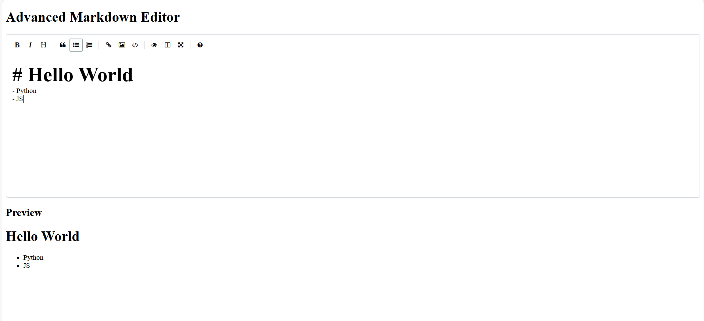

# 🌟 Advanced Markdown Editor  

Welcome to **Advanced Markdown Editor**! A simple, yet powerful tool to write and preview Markdown effortlessly. 🎉

## 🚀 Features  
- ✍️ **Live Preview**: See your Markdown rendered into HTML instantly.  
- 🔖 **Customizable Toolbar**: Access commonly used Markdown options easily.  
- 🛠️ **Autosave**: Your work is automatically saved, so you never lose progress.  
- 🌐 **Responsive Design**: Fully optimized for all devices.  
- 📜 **Supports Basic Markdown Syntax**: Including headings, lists, images, code, and more!  

---

## 🔗 Demo  

👉 **[Live Preview of the Markdown Editor](https://sadia-10.github.io/markdown-editor/)**  

Click the link above to test the editor live! 🚀  

---

## 🖥️ Technologies Used  

- **HTML5**  
- **CSS3** (Responsive design)  
- **JavaScript** (Interactive functionality)  
- **[EasyMDE](https://easymde.tk/)** library for the Markdown editor.  

---

## 📸 Screenshots  

### Markdown Editor Interface:  
✨ *A clean and user-friendly interface to craft your Markdown.*  

**Editor Mode and Preview Mode:**  

---

## 🛠️ Installation  

1. Clone the repository:  
   ```bash  
   git clone https://github.com/sadia-10/markdown-editor.git  
   ```  

2. Navigate to the project directory:  
   ```bash  
   cd markdown-editor  
   ```  

3. Open the `index.html` file in your browser or deploy the project to a web server for live usage.  

---

## 💡 How to Use  

1. Start typing your Markdown in the editor.  
2. Switch between **Editor Mode** and **Preview Mode** using the toolbar buttons.  
3. View the live-rendered Markdown in the preview pane below.  

---

## 🖋️ License  

This project is licensed under the **[MIT License](./license)**. Feel free to use and modify it as you wish.  
